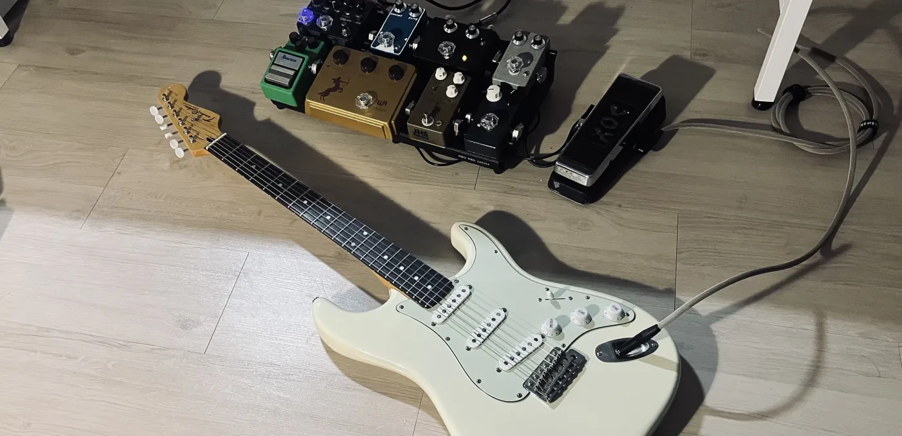

<!-- 
<div align="center">
  
</div>
-->

<details open>
  <summary><h2>👋</h2> <h6>(click)</h6></summary>

```yml
mbti: INFJ
school: Semyeong Computer High School
```

---

</details>

<details open>
  <summary><h2>🧩 Projects | 📘 Certificate/License</h2> <h6>(click)</h6></summary>
  <h4>□  Projects</h4>

  * **6502 Emulator** [[Source](https://github.com/yulmwu/6502)]
  * **Swua** [[Source](https://github.com/yulmwu/swua)] - Toy Programming Language
  * **Swua Bytecode** [[Rust](https://github.com/yulmwu/ussua) | [C++](https://github.com/yulmwu/uswua-cpp)] - Bytecode of Swua
  * **Blog** [[Source](https://github.com/eocndp/eocndp.github.io) | [Link](eocndp.github.io)]

  * **... etc**

  <h4>□  Certificate/License</h4>

  * **정보처리기능사** (취득 `필기 23/04/19`, `실기 23/09/20`)

---

</details>

<details open>
  <summary><h2>📬 Contact</h2> <h6>(click)</h6></summary>

  * **Discord** : [@rlawnsdud](https://discord.com/users/615383266412724246)
  * **Mail 1 (Personal)** : [normal8781@gmail.com](mailto:normal8781@gmail.com)
  * **Mail 2 (Business)** : [rlawnsdud0422@gmail.com](mailto:rlawnsdud0422@gmail.com)
  * **KakaoTalk ID** : `qhsiq826`
</details>
