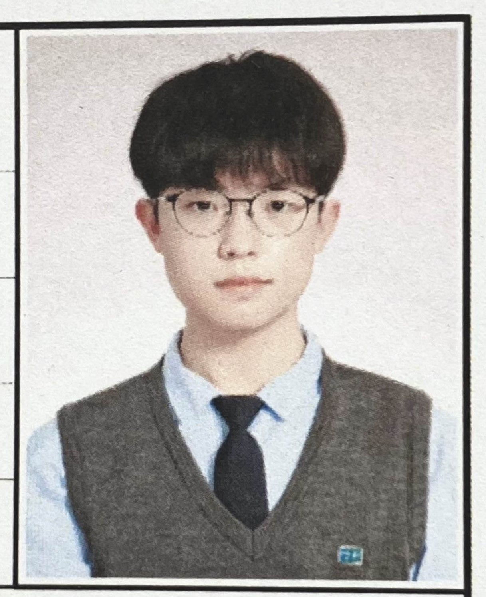

<div align="center">

## Hi there 👋


</div>

<details>
  <summary><h4>소개합니다 👋</h4> <h6>(접기/펼치기)</h6></summary>
  <a href="github.com/yulmwu"></a>

```
반갑습니다. MBTI는 첫 검사때 부터 INFJ입니다.
여자친구 없습니다..

궁금한건 연락 주세요~~

https://asked.kr/yulmwu
```
</details>
<details>
  <summary><h4>프로젝트/자격증 📘</h4> <h6>(접기/펼치기)</h6></summary>
  <h4>□ 프로젝트</h4>

  * **6502 Emulator** [[Source](https://github.com/yulmwu/6502)]
  * **Swua** [[Source](https://github.com/yulmwu/swua)] - Toy Programming Language
  * **Swua Bytecode** [[Rust](https://github.com/yulmwu/ussua) | [C++](https://github.com/yulmwu/uswua-cpp)] - Bytecode of Swua
  * **Blog** [[Source](https://github.com/eocndp/eocndp.github.io) | [Link](eocndp.github.io)]

  <h4>□ 자격증</h4>

  * **정보처리기능사** (취득 `필기 23/04/19`, `실기 23/09/20`)
</details>

